# 🚀 FinTrack – Personal Finance Tracker App

FinTrack is an Android app that helps users track their daily expenses, income, and monthly savings.  
The app provides simple insights to understand spending habits and manage money effectively.

---

## 📸 Screenshots

**Home Page**

  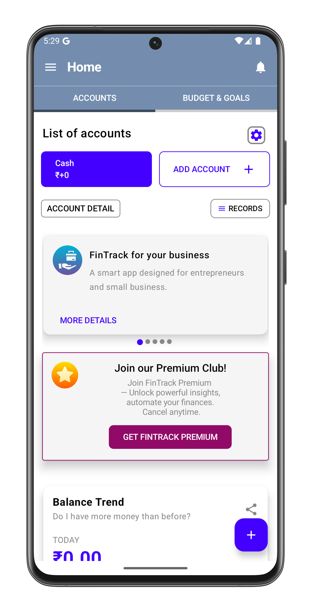
  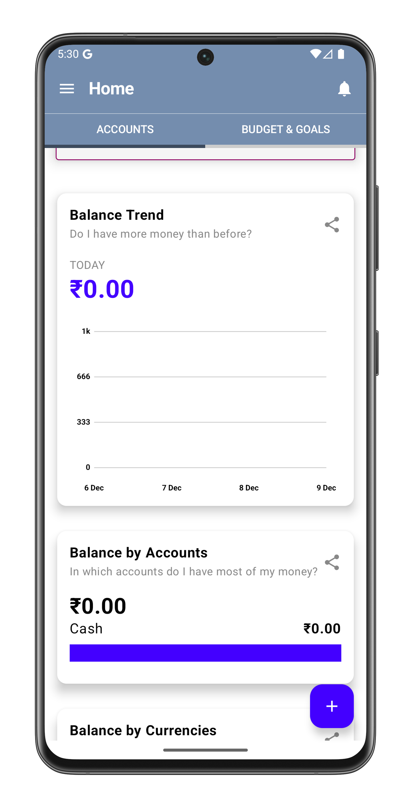
  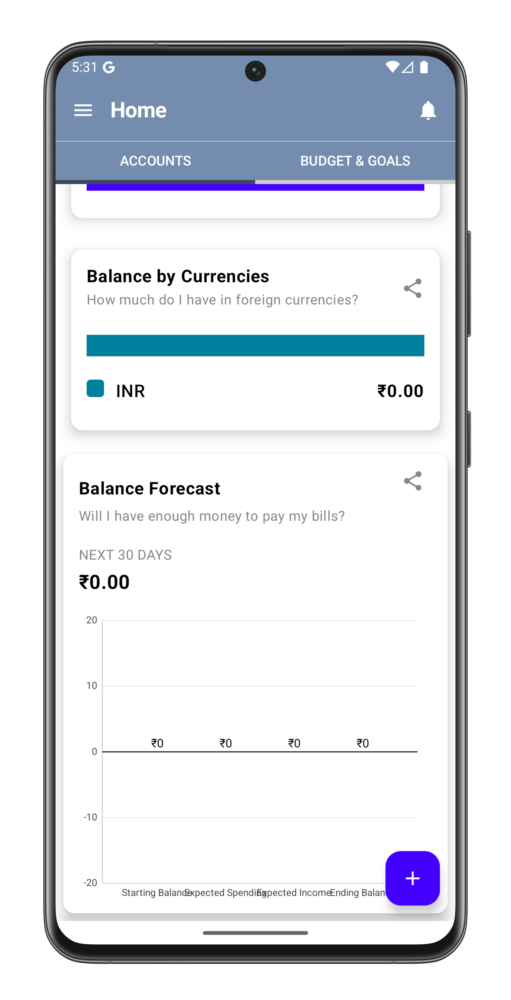

**Side Bar**

  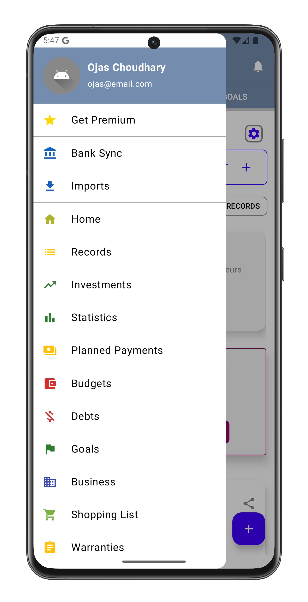
  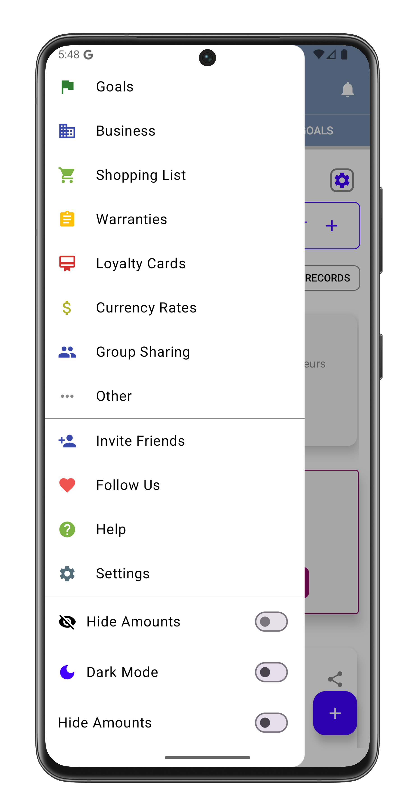

**Add Expense or Income**

  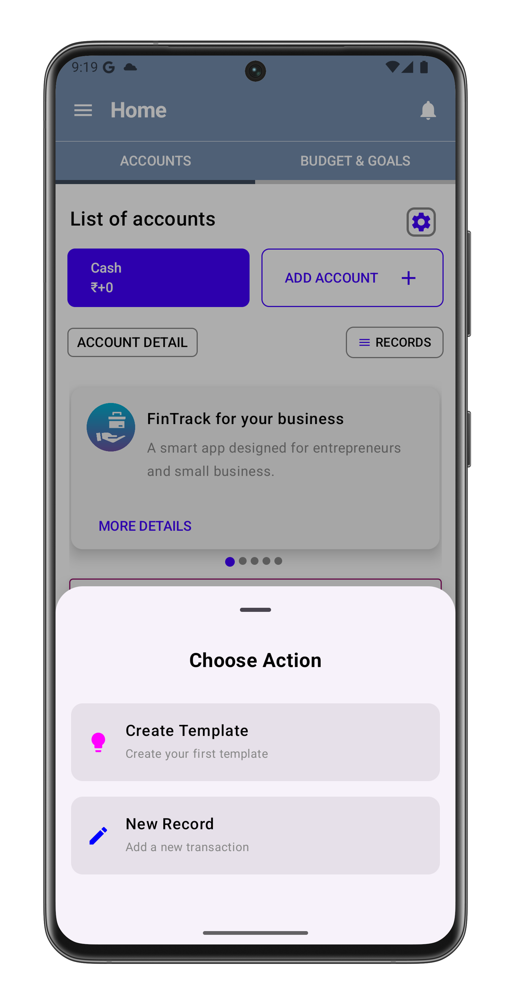
  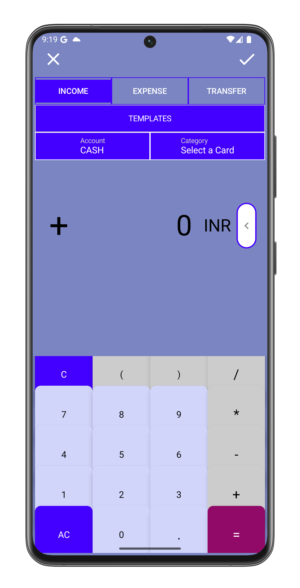
  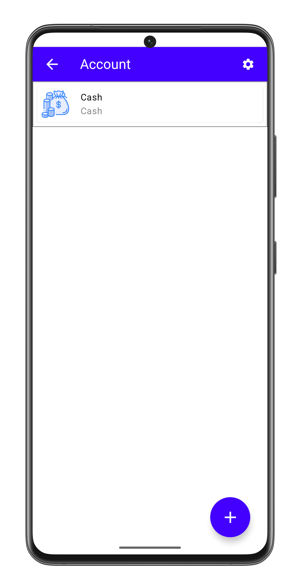
  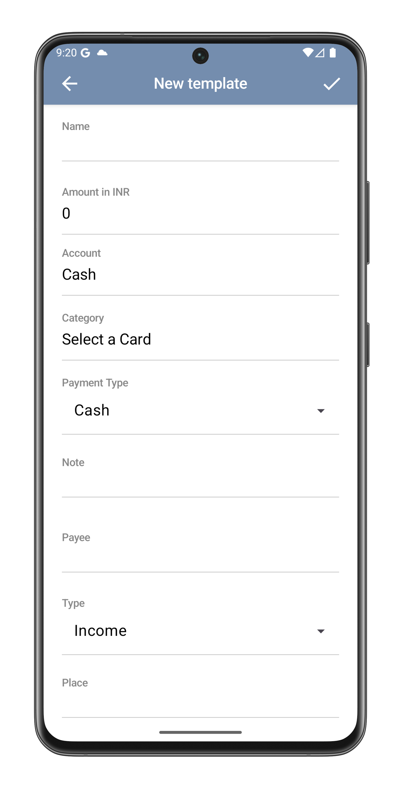
  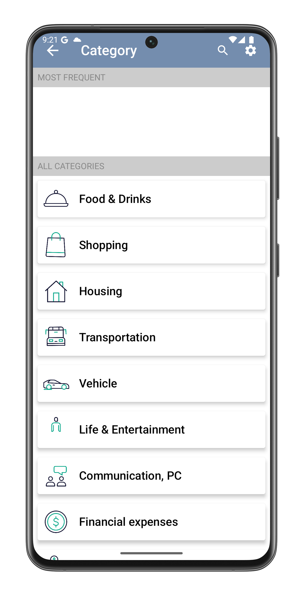
  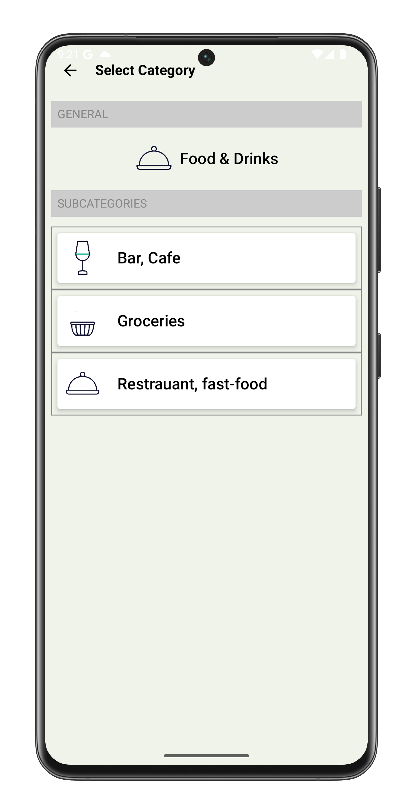
  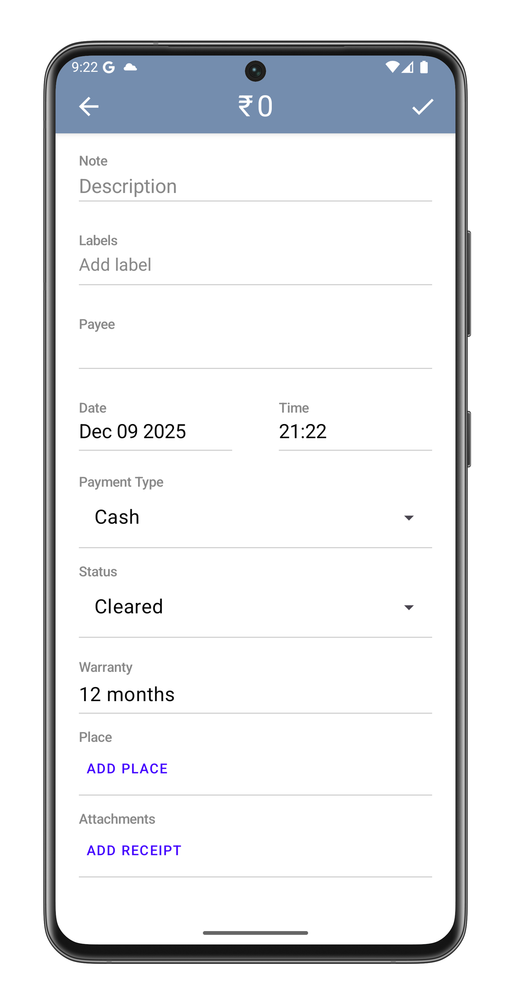
  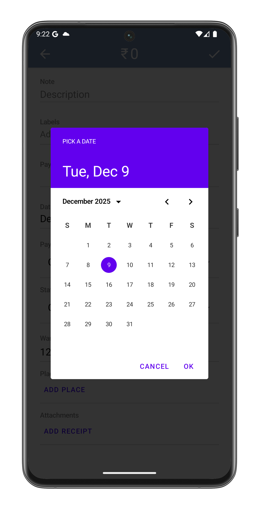
  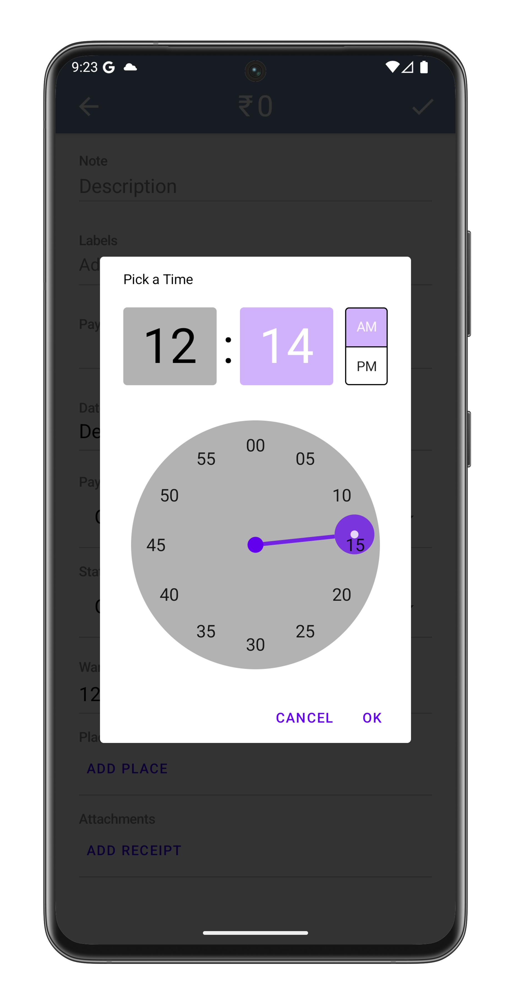
  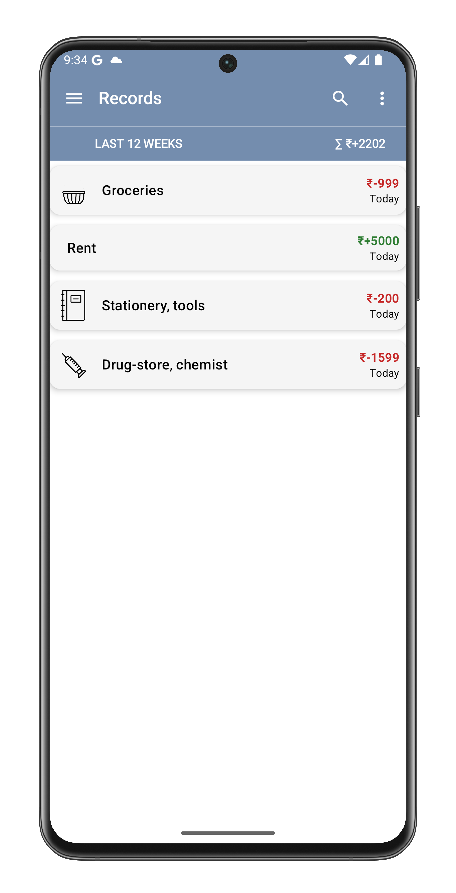

**Create a Budget**

  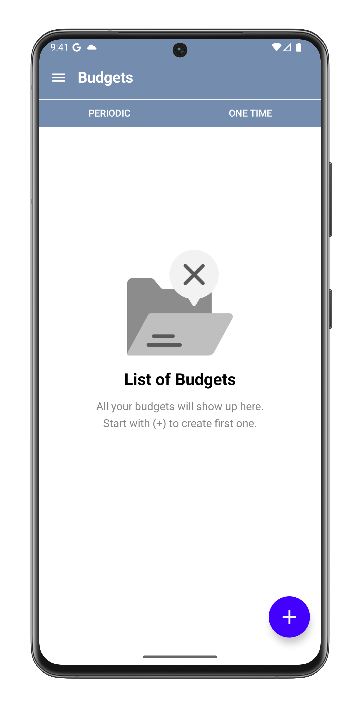
  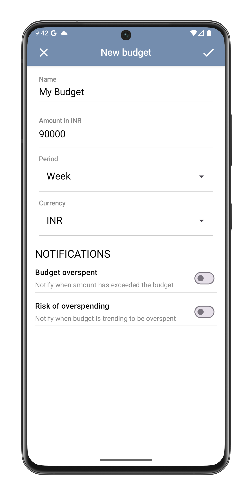
  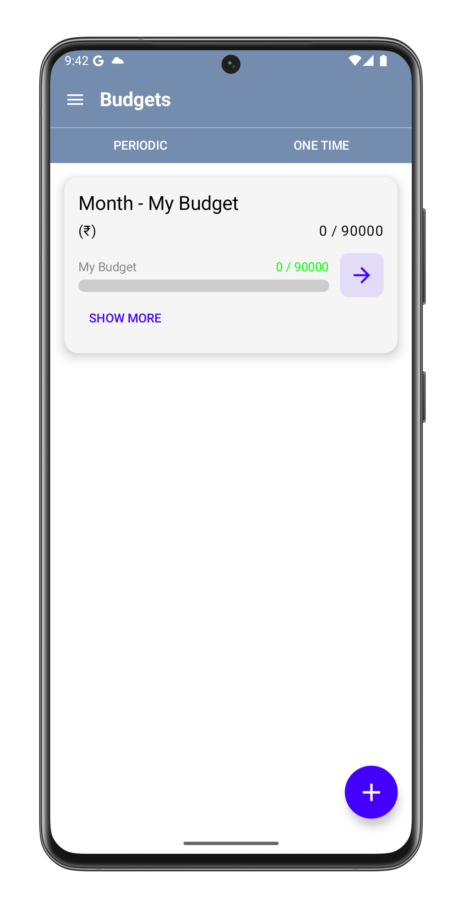

---

## 📱 Features

- ✔ Add & edit expenses  
- ✔ Track income and savings  
- ✔ Monthly summaries  
- ✔ Category-wise expense breakdown  
- ✔ Clean Jetpack Compose UI  
- ✔ Local data storage using Room DB  
- ✔ MVVM architecture  

---

## 🛠 Tech Stack

| Layer        | Technology                       |
|--------------|----------------------------------|
| UI           | Jetpack Compose, Material 3      |
| Architecture | MVVM                             |
| Data         | Room Database                    |
| Language     | Kotlin                           |
| State        | ViewModel + StateFlow            |

---
